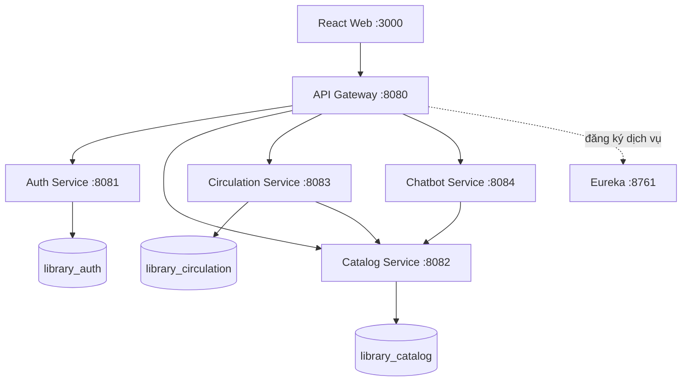

# Smart Library — Hệ thống quản lý thư viện tích hợp chatbot

Đồ án tốt nghiệp hoàn chỉnh xây dựng bằng **Java 21, Spring Boot, Spring Cloud Microservices, MySQL 8 và React 19**. Hệ thống phục vụ ba vai trò: quản trị viên, thủ thư và độc giả.

## Chức năng đã có

- Đăng ký, đăng nhập JWT/Google, quên mật khẩu qua email, đổi mật khẩu và cập nhật hồ sơ.
- Phân quyền `ADMIN`, `LIBRARIAN`, `MEMBER`; khóa/mở tài khoản.
- Quản lý sách, ISBN, tác giả, thể loại, nhà xuất bản, vị trí kệ, ảnh bìa.
- Quản lý riêng từng bản sách bằng mã vạch và trạng thái.
- Tìm kiếm, lọc, phân trang, xem tình trạng còn sách theo thời gian thực.
- Lập phiếu mượn, trả sách, gia hạn tối đa hai lần, tự cập nhật tồn kho.
- Đặt giữ/đặt trước, hàng chờ, tự gọi sách khi có bản trả, hết hạn lượt đặt và cho mượn từ lượt đặt.
- Tự tính phí quá hạn/hư hỏng/mất sách; thu phí hoặc miễn phí.
- Tủ sách cá nhân, yêu thích lưu theo tài khoản, lịch sử giao dịch, thông báo và hồ sơ độc giả.
- Dashboard quản trị, thống kê lưu hành và tiền phạt.
- Chatbot Libby tiếng Việt: tìm sách thật qua Catalog API, trả lời quy định và gợi ý sách.
- Giao diện responsive cho máy tính, máy tính bảng và điện thoại.

## Kiến trúc



## Cách 1 — Chạy bằng IntelliJ IDEA và MySQL Workbench

### 1. Cài công cụ

1. JDK 21 (Temurin/OpenJDK 21), kiểm tra bằng `java -version`.
2. IntelliJ IDEA; vào **File → Project Structure → Project SDK** và chọn JDK 21.
3. MySQL Server 8.x và MySQL Workbench. Đảm bảo MySQL chạy ở `localhost:3306`.
4. Node.js 20 trở lên.
5. Tùy chọn: Ollama nếu muốn chatbot dùng AI local khi chạy bằng IntelliJ.

### 2. Tạo database trong MySQL Workbench

Mở [database/init.sql](database/init.sql), bấm biểu tượng tia sét để chạy. Mặc định dự án dùng:

```text
username: root
password: 123456
```

Nếu mật khẩu MySQL của bạn khác, sửa `spring.datasource.password` trong ba file `application.yml` của `auth-service`, `catalog-service`, `circulation-service`.

### 3. Mở backend trong IntelliJ

1. Chọn **File → Open** và mở thư mục `backend` (nơi có `pom.xml`).
2. Chờ Maven tải hết dependency.
3. Kiểm tra Maven Runner JRE là Java 21 tại **Settings → Build Tools → Maven → Runner**.
4. Chạy lần lượt các class sau (nhấp phải → Run):
   - `DiscoveryServerApplication`
   - `AuthServiceApplication`
   - `CatalogServiceApplication`
   - `CirculationServiceApplication`
   - `ChatbotServiceApplication`
   - `ApiGatewayApplication`
5. Mở `http://localhost:8761` để kiểm tra các service đã đăng ký.

Hibernate tự tạo bảng và chương trình tự nạp dữ liệu mẫu ở lần chạy đầu.

### 4. Chạy React

Mở Terminal tại thư mục `frontend`:

```bash
npm install
npm run dev
```

Mở `http://localhost:5173`. API Gateway chạy tại `http://localhost:8080`.

### 5. Cấu hình đăng nhập Google và email khôi phục mật khẩu

1. Trong Google Cloud Console, tạo **OAuth 2.0 Client ID** loại **Web application** và thêm `http://localhost:5173` vào **Authorized JavaScript origins**.
2. Sao chép `frontend/.env.example` thành `frontend/.env.local`, rồi điền cùng một Client ID vào `VITE_GOOGLE_CLIENT_ID`.
3. Trong cấu hình chạy `AuthServiceApplication` của IntelliJ, khai báo các biến môi trường:

```text
GOOGLE_CLIENT_ID=<cùng Google Web Client ID ở frontend>
APP_FRONTEND_URL=http://localhost:5173
MAIL_HOST=smtp.gmail.com
MAIL_PORT=587
MAIL_USERNAME=<địa chỉ Gmail gửi thư>
MAIL_PASSWORD=<mật khẩu ứng dụng 16 ký tự>
MAIL_FROM=<địa chỉ Gmail gửi thư>
MAIL_SMTP_AUTH=true
MAIL_SMTP_STARTTLS=true
```

Với Gmail, `MAIL_PASSWORD` phải là **mật khẩu ứng dụng**, không phải mật khẩu đăng nhập thông thường. Không ghi Client Secret hoặc mật khẩu email vào mã nguồn. Luồng Google này dùng Google Identity Services: trình duyệt nhận ID token, backend kiểm tra chữ ký/audience/issuer/thời hạn rồi mới cấp JWT của Smart Library.

Nếu chạy chatbot AI bằng IntelliJ, cài Ollama rồi chạy `ollama pull qwen2.5:3b`. Nếu chưa có Ollama, chatbot vẫn trả lời bằng logic nội bộ và dữ liệu Catalog.

## Cách 2 — Chạy toàn bộ bằng Docker

Nếu đã cài Docker Desktop, tại thư mục gốc chạy:

```bash
copy .env.example .env     # PowerShell: Copy-Item .env.example .env
# điền GOOGLE_CLIENT_ID, VITE_GOOGLE_CLIENT_ID, các MAIL_* và OLLAMA_MODEL nếu cần trong .env
docker compose up --build
```

Trong Google Cloud, thêm cả `http://localhost:3000` vào **Authorized JavaScript origins** khi chạy Docker. Docker Compose đã có service Ollama; sau lần chạy đầu, nếu model chưa có thì chạy `docker exec smart-library-ollama ollama pull qwen2.5:3b`. Chờ khoảng 2–5 phút ở lần đầu rồi mở `http://localhost:3000`. Dừng hệ thống bằng `docker compose down`; thêm `-v` nếu muốn xóa luôn dữ liệu MySQL và model Ollama.

## Tài khoản mẫu

| Vai trò | Email | Mật khẩu |
|---|---|---|
| Quản trị | `admin@library.vn` | `Library@123` |
| Thủ thư | `librarian@library.vn` | `Library@123` |
| Độc giả | `member@library.vn` | `Library@123` |

## Cổng dịch vụ

| Thành phần | Cổng |
|---|---:|
| React dev / Docker | 5173 / 3000 |
| API Gateway | 8080 |
| Auth / Catalog / Circulation / Chatbot | 8081 / 8082 / 8083 / 8084 |
| Eureka | 8761 |
| MySQL | 3306 |`r`n| Ollama | 11434 |

## Lưu ý triển khai thật

- Đổi `JWT_SECRET` và mật khẩu MySQL bằng biến môi trường; không commit bí mật.
- API quên mật khẩu luôn trả thông báo chung để tránh dò email; reset token 256-bit chỉ được gửi qua SMTP trong URL fragment, backend chỉ lưu bản băm SHA-256 và token hết hạn sau 15 phút.
- Khi triển khai lên tên miền thật, thêm origin HTTPS của frontend vào Google Cloud và cập nhật `APP_FRONTEND_URL`, `APP_CORS_ALLOWED_ORIGINS` tương ứng.
- Ảnh bìa đang nhận URL. Có thể thay bằng S3/Cloudinary mà không cần đổi mô hình dữ liệu.
- Chính sách hiện tại: 14 ngày/lượt, gia hạn 2 lần × 7 ngày, quá hạn 5.000đ/ngày, hư hỏng 50.000đ, mất sách 200.000đ.


